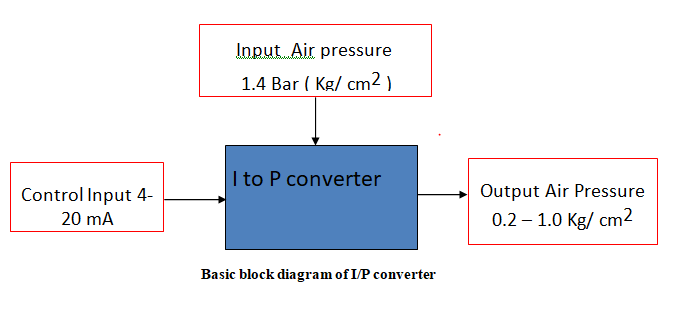
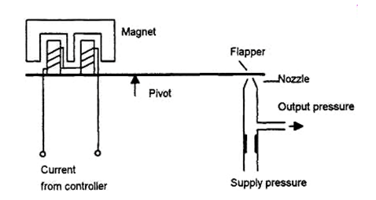

A current to pressure  converter also known as current to pressure transducer converts 4 to 20 mA analog signal into proportional  0.2 to 1 Kg/cm^2 ( 3 to 15 psig) pneumatic signal. It is necessary to translate electrical output from control system into corresponding pressure signal to operate pneumatic actuators, pneumatic valves, dampers etc.

It is a link between
–	electric controller ( which has a standard 4-20 mA current output ) 
–	and pneumatic actuators which operate on air pressure

Usually direct action and reverse action are the two types that are  available. Selection of the  
action depends on the type of final control element I.e. control valve and actuator available in the process. The device can be wall mounted or pipe mounted or on the valve actuator  depending upon the vibrations existing in the plant.

## Prerequisite:
* Basic block diagram of Feedback control system
* Working of flapper Nozzle sensor

  

## Working Principle:
The input to the I/P converter is control signal from electronic controllers varying in the range of 4 mA to 20 mA. This input is connected to the voice coil assembly which consists of a permanent magnet and an electromagnetic coil. The name voice call is because of its  resemblance with the  audio amplifier circuit. A soft iron piece is attached to the flapper which is attracted towards coil due to magnetisation of the coil. The extent of pull towards coil depends on the magnitude of the current passing through the coil which is a control signal or output of the controller. 

As per the variations in the current through the coil, the magnetic strip attached to the coil  is attracted or repelled. Due to this, the flapper in the flapper nozzle sensor is repelled or attracted towards the nozzle. As there is pivot at the centre, when the strip is attracted at the coil end, it moves away from the nozzle.   Also when the strip is repelled  at the coil end, it moves closer to the nozzle.

When flapper moves away from the nozzle, the output pressure decreases and  the output pressure increases if flapper comes closer to the nozzle.

The transducer is to be calibrated such as,  when the input is 4 mA, the output pressure is 0.2 Kg/cm^2 and when input is 20 mA, the output pressure is 1Kg/cm^2.

## Calibration Procedure:

1. Open protective covers to expose zero and span adjustment screws.

2. Connect 1.4 Kg/cm^2 i.e. 20 psig supply pressure and connect input signal i.e. 4-20 mA.

3. Set the input signal to 4 mA and check the output pressure on gauge as 3 psig.

If necessary adjust zero screw until reaching 0.2 Kg/cm^2 i.e. 3 psig. Turn zero screw counter clockwise to increase pressure, clockwise to decrease pressure. 

4. Set the input current signal to 20 mA and check the output pressure on gauge as 1 Kg/cm^2 i.e. 15 psig.

If necessary adjust the span screw until reaching 15 psig pressures. Turn span screw counter clockwise to increase pressure, clockwise to decrease pressure.

5. Repeat step 3 to check that the desired low value (4 mA ~ 3 psig) has not changed after adjusting the span. If necessary repeat steps 4 through 5 to fine-tune the unit.

## Zero adjustment: As per the working standard of the I/P converter if the 4 mA current is applied to the coli the output of the converter should be 0.2 Kg.cm^2. This output depends on the distance between flapper and nozzle. Due to change in distance between flapper and nozzle may change and hence using the zero screw the distance between flapper and nozzle is adjusted so as to obtain 0.2 Kg/cn^2.

## Span Adjustment: The output of the I/P converter should be 1 kg/cm^2 when 20 mA current is applied. When we apply 20 mA current the flapper tilts and the distance between flapper and nozzle is reduces in turn increasing the back pressure. In case the output is equal to 1 kg/cm^2, even if we apply 20 mA, then the nozzle is displaced towards the tip reducing the distance between flapper and nozzle in turn increasing the output pressure. This is true for direct acting I/P converter while opposite response will be observed if it is reverse acting. While adjusting the span the position of nozzle is changed hence when the control signal is made 4 mA, the output will not be 0.2 Kg.cm^2 hence adjustment of zero becomes mandatory. To complete the calibrations minimum three iterations are advised.     

